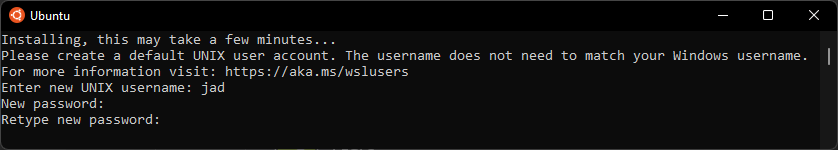
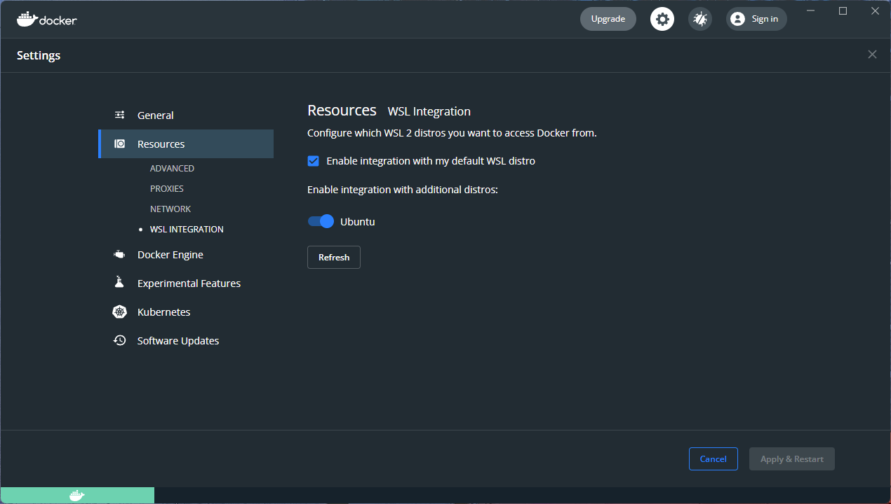
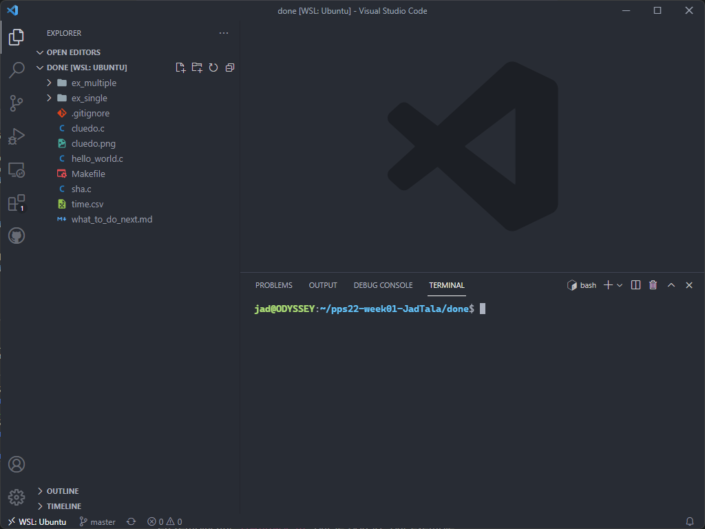

# Possible workflow for CS212 on Windows: WSL and VSCode

### Windows Subsystem for Linux (WSL) allows to run Linux binaries natively on Windows, and using Visual Studio Code, one can work on projects for Linux, let's see how to set this up:

## Install a Windows Subsystem for GNU/Linux distribution
- [Follow](https://progmaph.epfl.ch/series/Ubuntu_sous_Windows.pdf) the course's instructions to enable WSL, i.e. until step 3. 
- Get the Ubuntu WSL (No Arch for today...) from [here](https://www.microsoft.com/en-us/p/ubuntu/9nblggh4msv6).

- Open it and enter a username and password to set it up. (Beware! The password's characters are invisible)



## Set up the SSH key on WSL
- Follow [the course's instructions at the GitHub section](https://projprogsys-epfl.github.io/project/warmup/handout01/), if the key generation somehow results in `Saving key failed: Permission denied`, run `sudo chown ${USER} ~/.ssh/` to fix the directory's ownership.

## Install Docker for Windows
- Get Docker Desktop [here](https://docs.docker.com/get-docker/), the installation is straightforward, just make sure that anything mentioning WSL 2 is enabled, this will allow us to run Docker inside the WSL to run `make feedback`.

- Once the installation is done and you've logged out and in again, open Docker Desktop and go to the settings on the upper right once it's started, then Resources > WSL INTEGRATION and enable it for Ubuntu.



## Install the required development packages

- Open Ubuntu then update and upgrade the system:
```console
sudo apt update
sudo apt upgrade
```

- Then install the required packages for the lab:

```console
sudo apt install make gcc git openssh-client manpages manpages-dev doxygen
sudo apt install libssl-dev libssl-doc libcurl4-openssl-dev libjson-c-dev
```

## Use Visual Studio Code with the WSL
- [Install](https://code.visualstudio.com/download) Visual Studio Code if you haven't yet.
- Clone the lab's git repository.
- Go to its directory using the Ubuntu terminal and open it with VS Code by running the command `code .` (or run `code` following by the absolute path of the directory to open it from anywhere), this will setup everything and open a VS Code window, then eventually...



You can edit your project, and open an integrated WSL terminal (Upper Menu Bar > Terminal > New Terminal) to do anything Ubuntu-specific (`apt`, `gcc`, `make`) while staying Windows!

## Final notes 

Now that VS Code is setup, the next time you want to work using the WSL, no need to navigate to the directory from a Ubuntu terminal and run `code .`.

Instead, open VS Code from Windows and click on the lower left icon, then choose "New WSL Window", this will attach a VS Code instance to the WSL like before, then navigate to the repo's directory using "Open Folder" (Use "Show Local" to show Windows folders).

You may also want to install the [C/C++ VS Code extension](https://marketplace.visualstudio.com/items?itemName=ms-vscode.cpptools) if not already, to get more perks!

### Hope this is useful, have coding!